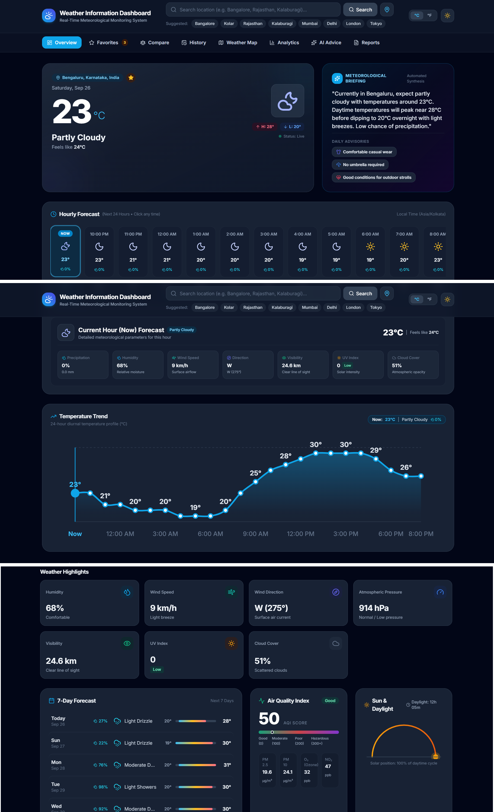
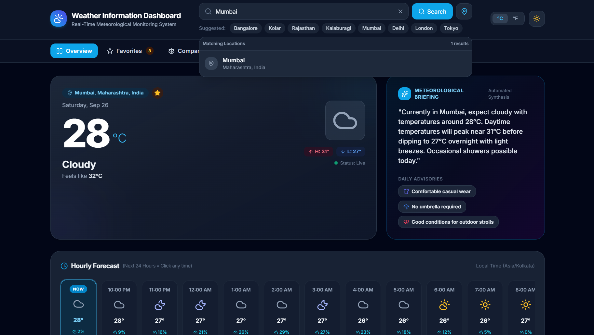
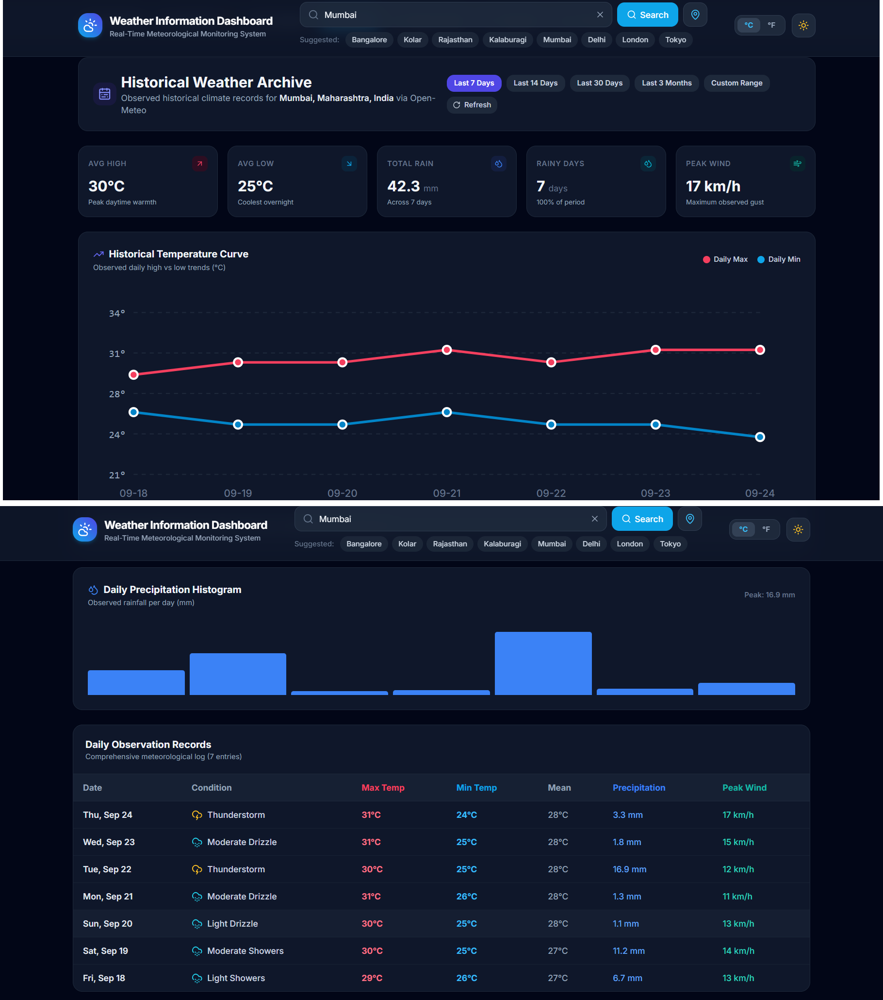
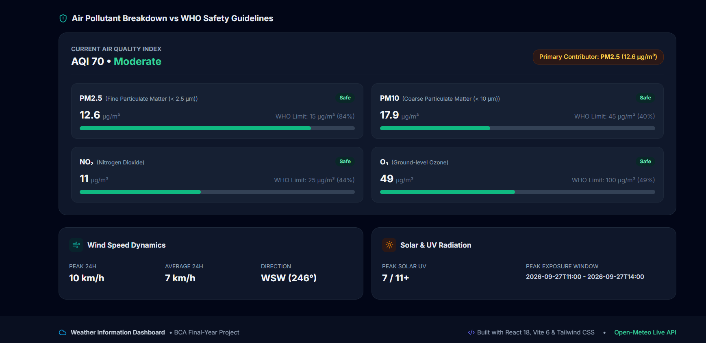
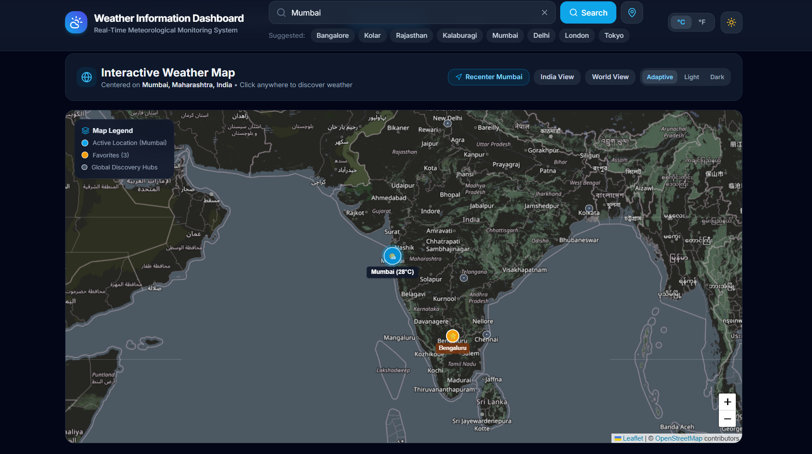
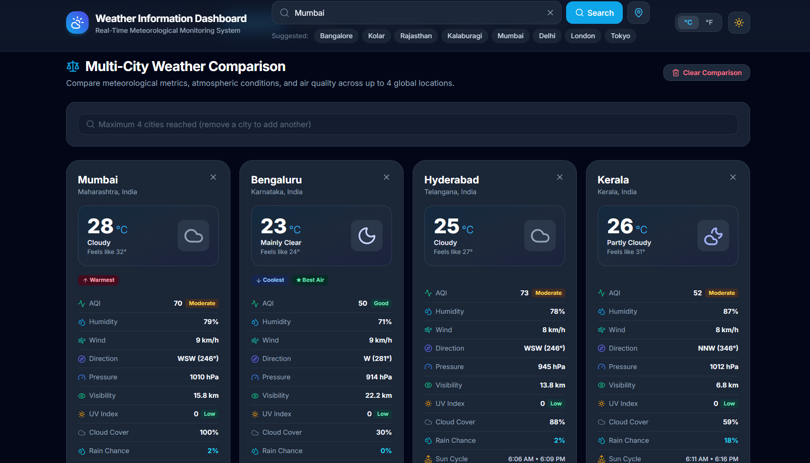
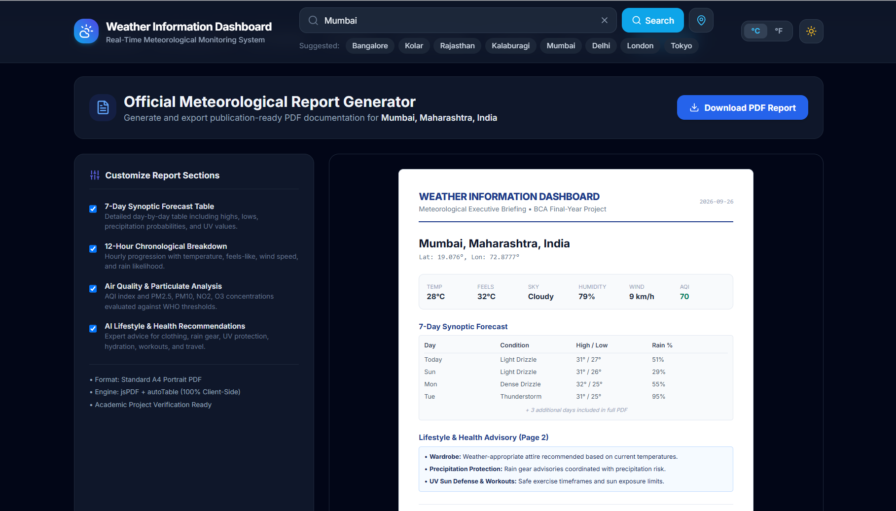

# WEATHER INFORMATION DASHBOARD

**Project README / Reference Document**

## Weather Information Dashboard

A web-based Weather Information Dashboard developed using React, Vite, JavaScript, Tailwind CSS, Leaflet, and Open-Meteo APIs. The application provides real-time weather monitoring, forecasts, historical weather information, air-quality analysis, interactive maps, multi-city comparison, analytics, recommendations, and PDF report generation through a professional responsive web interface.

The dashboard is designed as a BCA final-year project and brings multiple meteorological services together in one application for easier weather monitoring and analysis.

---

## Features

- Real-Time Weather Monitoring
- Current Temperature and Weather Condition
- Feels-Like Temperature
- High and Low Temperature Information
- Hourly Weather Forecast
- 7-Day Weather Forecast
- Humidity Monitoring
- Wind Speed and Direction
- Atmospheric Pressure
- Visibility Information
- UV Index
- Cloud Cover
- Precipitation Probability
- Weather Highlights
- Temperature Trend Visualization
- Meteorological Briefing
- Weather Recommendations and Daily Advisories
- Location Search with Autocomplete
- Support for Indian and Global Locations
- Historical Weather Archive
- Historical Temperature Trend
- Historical Precipitation Analysis
- Daily Historical Observation Records
- Air Quality Index Monitoring
- PM2.5, PM10, NO₂, and O₃ Information
- WHO Guideline Comparison
- Wind Speed Dynamics
- Solar and UV Radiation Information
- Interactive Leaflet Weather Map
- Active Location and Favorite Location Markers
- Map-Based Location Discovery
- Multi-City Weather Comparison
- Comparison of Temperature, AQI, Humidity, Wind, Pressure, Visibility, UV, Cloud Cover, and Rain Chance
- Weather Analytics
- AI-Assisted Weather and Lifestyle Recommendations
- Favorite Locations
- PDF Weather Report Generation
- Customizable PDF Report Sections
- Responsive Dark-Themed User Interface
- API Error Handling and Loading States
- Mobile-Friendly Layout

---

## Tech Stack

### Frontend

- React
- JavaScript
- HTML5
- CSS3
- Tailwind CSS
- Vite

### Maps

- Leaflet
- OpenStreetMap

### Weather and Location APIs

- Open-Meteo Weather API
- Open-Meteo Forecast API
- Open-Meteo Historical Weather API
- Open-Meteo Air Quality API
- Open-Meteo Geocoding API
- Nominatim fallback for location search where applicable

### PDF Generation

- jsPDF
- jsPDF-AutoTable

### Development Tools

- Node.js
- npm
- Vite Development Server
- Git
- GitHub

---

## Project Structure

```text
weather dashboard/
│── README.md
│── package.json
│── package-lock.json
│── vite.config.js
│
├── public/
│
├── screenshots/
│   ├── dashboard.png
│   ├── search.png
│   ├── history.png
│   ├── air-quality.png
│   ├── weather-map.png
│   ├── city-comparison.png
│   └── report.png
│
└── src/
    ├── components/
    ├── pages/
    ├── services/
    ├── utils/
    ├── App.jsx
    ├── main.jsx
    └── index.css
```

> The exact component and service filenames may vary with the current project version. The main application is organized around reusable React components, page views, API/service modules, and utility functions.

---

## Application Data Flow

```text
User
   ↓
React / Vite Interface
   ↓
Location Search
   ↓
Open-Meteo Geocoding
   ↓
Latitude + Longitude
   ↓
Weather / Air Quality / Historical APIs
   ↓
Weather Service Layer
   ↓
Data Processing and Formatting
   ↓
Dashboard Components
   ↓
Charts / Cards / Tables / Map / Reports
```

---

## Weather Data Workflow

1. User searches for a location.
2. The location is converted into coordinates using geocoding.
3. The application requests weather data using latitude and longitude.
4. Current conditions are processed and displayed.
5. Hourly forecast data is displayed in the hourly forecast section.
6. Daily forecast data is displayed in the 7-day forecast.
7. Additional meteorological parameters are processed for weather highlights.
8. Temperature data is used to generate the temperature trend.
9. Weather information is used to generate briefing and recommendation content.
10. The dashboard updates when another location is selected.

---

## Historical Weather Workflow

The Historical Weather module provides an archive-style view of observed weather information for a selected location and period.

The workflow includes:

1. Select or search for a location.
2. Obtain the location coordinates.
3. Select a predefined period such as:
   - Last 7 Days
   - Last 14 Days
   - Last 30 Days
   - Last 3 Months
   - Custom Range
4. Request historical weather observations.
5. Process maximum and minimum temperatures.
6. Calculate or display rainfall information.
7. Display rainy-day information.
8. Display peak wind information.
9. Generate the historical temperature curve.
10. Generate the daily precipitation histogram.
11. Display daily observation records.

---

## Air Quality Workflow

The Air Quality module retrieves air-quality information for the selected location.

The module displays:

- Current Air Quality Index
- AQI Category
- PM2.5
- PM10
- NO₂
- O₃
- WHO Guideline Comparison
- Primary Pollutant Information
- Wind Speed Dynamics
- Solar and UV Radiation

```text
Location
   ↓
Coordinates
   ↓
Open-Meteo Air Quality API
   ↓
Pollutant Data
   ↓
AQI Processing
   ↓
Safety / WHO Comparison
   ↓
Air Quality Dashboard
```

---

## Location Search Workflow

The location search system provides searchable locations with autocomplete support.

The search process includes:

- User text input
- Debounced search
- Open-Meteo geocoding
- Local location indexes for commonly used Indian locations
- Search ranking and relevance handling
- Location suggestions
- City and region information
- Coordinate-based weather loading
- Fallback location search where applicable

Example supported searches include Indian and international locations such as:

```text
Bengaluru
Kolar
Mumbai
Delhi
Hyderabad
Chennai
Pune
Kolkata
London
Tokyo
New York
Paris
Dubai
Sydney
```

---

## Weather Map Workflow

The application includes an interactive Leaflet-based weather map.

The map provides:

- Active location marker
- Favorite location markers
- Discovery hub markers
- Location labels
- Weather information on markers
- Recenter functionality
- India View
- World View
- Adaptive / Light / Dark map presentation
- Zoom controls
- Click-based location discovery
- OpenStreetMap map tiles

```text
Selected Location
       ↓
Latitude + Longitude
       ↓
Leaflet Map
       ↓
Weather / Location Markers
       ↓
Interactive Map View
```

---

## City Comparison

The Multi-City Weather Comparison module allows weather information for multiple locations to be viewed together.

The comparison can include:

- Current Temperature
- Weather Condition
- Feels-Like Temperature
- AQI
- Humidity
- Wind Speed
- Wind Direction
- Atmospheric Pressure
- Visibility
- UV Index
- Cloud Cover
- Rain Chance
- Sun Cycle

The interface supports comparison of up to four locations.

---

## Weather Analytics

The dashboard provides visual analytics for understanding weather conditions.

Analytics include:

- Temperature trends
- Daily maximum and minimum temperature
- Historical temperature curves
- Rainfall distribution
- Wind behavior
- Air-quality measurements
- Weather highlights
- Forecast summaries

Charts and visual cards help convert API data into information that is easier to understand.

---

## Weather Recommendations

The dashboard provides weather-based advisories and recommendations.

Examples include:

- Clothing recommendations
- Umbrella / precipitation advice
- Outdoor activity guidance
- UV protection information
- General weather comfort information

Recommendations are generated from the available weather conditions and forecast information.

---

## PDF Report Generation

The Reports module generates a publication-ready weather report in PDF format.

The report can include:

- Current weather summary
- Location and coordinates
- 7-Day Synoptic Forecast Table
- 12-Hour Chronological Breakdown
- Air Quality and Particulate Analysis
- Lifestyle and Health Recommendations

The report is generated on the client side using:

```text
jsPDF
jsPDF-AutoTable
```

The interface also provides selectable report sections and a **Download PDF Report** button.

---

## API Integration

The project uses Open-Meteo services for weather, historical, air-quality, and geocoding information.

### Weather API

Provides current weather, hourly forecast, and daily forecast information.

### Historical Weather API

Provides historical weather observations for selected locations and periods.

### Air Quality API

Provides pollutant and air-quality information such as PM2.5, PM10, NO₂, and O₃.

### Geocoding API

Converts a location name into latitude, longitude, city, and regional information.

### Map Service

Leaflet is used for interactive mapping with OpenStreetMap tiles.

---

## User Interface

The application includes:

- Dashboard / Overview
- Favorites
- City Comparison
- Historical Weather
- Weather Map
- Analytics
- AI Advice
- Reports
- Location Search
- Weather Summary Cards
- Forecast Cards
- Interactive Charts
- Air Quality Cards
- Weather Map Controls
- Responsive Navigation
- Loading Indicators
- Error and Empty States
- Dark-Themed Professional Layout

The interface is designed for both desktop and smaller-screen layouts.

---

## Error Handling and Data Integrity

The application uses defensive handling for API and UI failures.

The project includes:

- Loading states
- Empty states
- API error messages
- Fetch failure handling
- Forecast fallbacks where supported
- Defensive rendering of missing API fields
- Location validation
- Search validation
- Historical date validation
- Report rendering safeguards
- Graceful handling of unavailable data

These measures help prevent a single unavailable API response or missing value from causing the complete interface to become blank.

---

## Installation

### 1. Clone the Project

```bash
git clone https://github.com/Avishgr5952/Weather-information-Dashboard-.git
cd Weather-information-Dashboard-
```

### 2. Install Dependencies

```bash
npm install
```

### 3. Start the Development Server

```bash
npm run dev
```

If PowerShell blocks `npm.ps1`, Windows users can also run:

```bash
npm.cmd run dev
```

### 4. Open the Application

The Vite development server normally runs at:

```text
http://localhost:3000
```

The exact port may change if the configured port is unavailable.

---

## Screenshots

### Dashboard



### Location Search



### Historical Weather



### Air Quality



### Weather Map



### City Comparison



### Weather Report



---

## Testing Checklist

The application was tested across major dashboard features including:

- Dashboard loading
- Current weather display
- Location search
- Search autocomplete
- Multiple Indian locations
- International location search
- Historical weather
- Air quality
- Weather map
- City comparison
- Reports
- PDF generation
- Responsive layout
- Mobile map layout
- Production build

---

## Build Verification

The project uses Vite for production builds.

Run:

```bash
npm run build
```

A successful build confirms that the application can be compiled for production without build-time errors.

The generated production files are placed in the standard Vite output directory.

---

## Responsive Design

The application is designed to work across:

- Desktop screens
- Laptop screens
- Tablet screens
- Mobile screens

The interface uses responsive layouts, flexible cards, adaptive navigation, and responsive map presentation.

Mobile layout testing was also performed to check for horizontal overflow and usability of the weather map.

---

## Future Enhancements

- Weather Alerts and Notifications
- More Detailed Long-Term Historical Analysis
- Additional Weather Data Providers
- User Authentication
- Cloud-Based User Profiles
- Persistent Favorites Across Devices
- Advanced Weather Forecast Visualizations
- More International Location Coverage
- Additional Air Pollutants
- Weather Data Export to Excel / CSV
- Scheduled Weather Reports
- Email Report Delivery
- Progressive Web App Support
- Advanced Forecast Accuracy Analysis
- Additional Map Weather Layers
- More Machine-Learning-Based Weather Insights

---

## Learning Outcomes

The project provides practical experience in:

- React development
- Vite project configuration
- JavaScript programming
- Component-based UI development
- Tailwind CSS
- REST API integration
- JSON data processing
- Geocoding
- Weather data analysis
- Historical data handling
- Air-quality analysis
- Interactive map integration
- Leaflet mapping
- Data visualization
- Responsive web design
- Error handling
- Client-side PDF generation
- Git and GitHub
- Full-stack-style frontend application development

---

## Author

**Student Name:** Avish

**Course:** BCA

**Project:** Weather Information Dashboard

**Project Type:** BCA Final-Year Project

**Technologies:**

React | Vite | JavaScript | Tailwind CSS | Leaflet | Open-Meteo | jsPDF

---

## GitHub

https://github.com/Avishgr5952/Weather-information-Dashboard-

---

## License

This project is developed for educational, academic, internship, and portfolio purposes.
